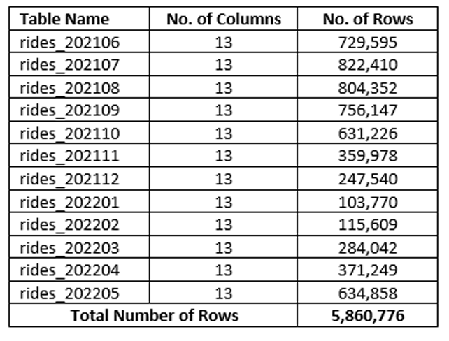
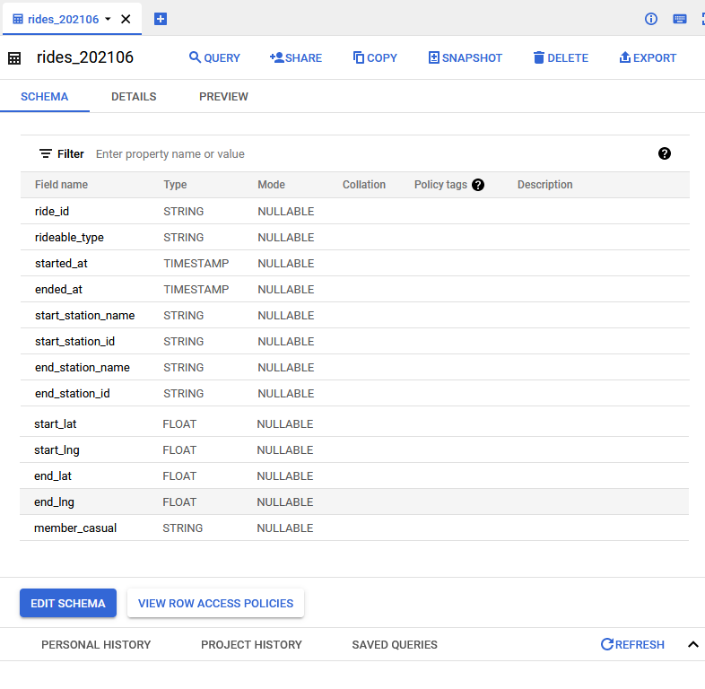
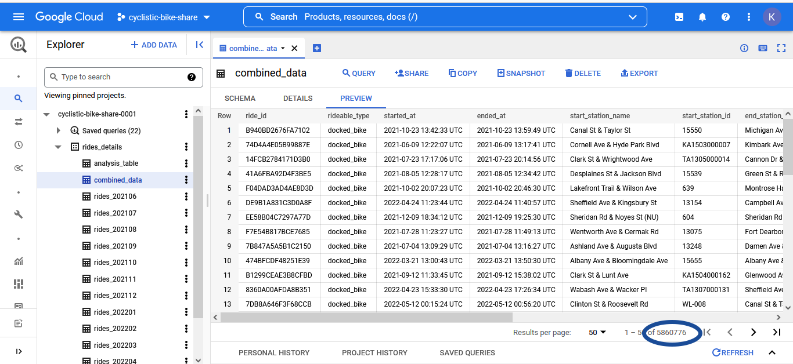

# Title: Google Capstone - Cyclistic bike share
# Author: Khaled Faisal
# Date: 2022-07-16


## Project Summary
This is capstone for Google data analytics certificate.
Data related to the project has been made available by Motivate International Inc. under this [license](https://ride.divvybikes.com/data-license-agreement).
Project ultimate goal is to design marketing strategies for Cyclistic bike share company aimed at converting casual riders into annual members, and business question assigned to me is : How do annual members and casual riders use Cyclistic bikes differently?
Project's Stake holders are Lily Moreno the director of marketing, Cyclistic executive team, and Cyclistic marketing analytics team, for the first two stakeholders I created a presentation can be downloaded from [here](https://downgit.github.io/#/home?url=https://github.com/khaled-FH/google_capstone/blob/main/Cyclistic%20Riders%E2%80%99%20Behavior%20Analysis.pptx) to answer the assigned question, and for the last stakeholder I kept a log of my work and saved queries and VIZ work in BigQuery and Tableau respectively.
# Project's data Summary
Data available in separate monthly ZIP format files to download and after extracting the files we get CSV format files, and the summary is as shown below:



# Data Exploration
When opening the data using Microsoft Excel, I noticed that the program is spending much time to open the file so I decided to start the project using Google BigQuery.
First step after uploading the data to the data set is to confirm if the tables contains the same number of columns in the same order with the same schema which is confirmed and all tables contain the same structure as per the below screenshot for one of the tables schema



Then I decided to combine all tables in one as per the below code
```sql
CREATE TABLE rides_details.combined_data AS (SELECT * 
FROM rides_details.rides_202106 
UNION ALL
SELECT * 
FROM rides_details.rides_202107 
UNION ALL
SELECT * 
FROM rides_details.rides_202108 
UNION ALL
SELECT * 
FROM rides_details.rides_202109
UNION ALL
SELECT * 
FROM rides_details.rides_202110 
UNION ALL
SELECT * 
FROM rides_details.rides_202111 
UNION ALL
SELECT * 
FROM rides_details.rides_202112 
UNION ALL
SELECT * 
FROM rides_details.rides_202201 
UNION ALL
SELECT * 
FROM rides_details.rides_202202 
UNION ALL
SELECT * 
FROM rides_details.rides_202203 
UNION ALL
SELECT * 
FROM rides_details.rides_202204 
UNION ALL
SELECT * 
FROM rides_details.rides_202205)
```
The query generated the table and I confirmed that the number of rows in this table equal to the sum of all rows mentioned above in the data summary section and as per below image:



# Processing Data

1- Check duplicates “ride_id” the primary key
```sql
SELECT 
 DISTINCT(ride_id)
FROM `cyclistic-bike-share-0001.rides_details.combined_data`

```
Total Rows are 5,860,776 matching table total rows, so no duplicates in the primary key

2- Check NULLS in “started_at” and “ended_at”
```sql
SELECT 
 started_at
FROM `cyclistic-bike-share-0001.rides_details.combined_data`
WHERE started_at IS NULL
```  
 No Null found in “started_at”
 
```sql
SELECT 
 ended_at
FROM `cyclistic-bike-share-0001.rides_details.combined_data`
WHERE ended_at IS NULL 
``` 
 No Null found in “ended_at”
 
3- Check Nulls “start_station_name” and “start_station_id”
```sql
SELECT 
 ride_id,
 start_station_name,
 start_station_id
FROM `cyclistic-bike-share-0001.rides_details.combined data` 
WHERE start_station_name IS NULL
```
 Return 823167 Rows
```sql
SELECT 
 ride_id,
 start_station_name,
 start_station_id
FROM `cyclistic-bike-share-0001.rides_details.combined_data` 
WHERE start_station_id IS NULL
```
 Return 823164 Rows
 The difference shows that there are 3 rows has start_station_id but does not have start_station_name
 
4- To Know what is the difference I used the below query
```sql
SELECT 
 ride_id,
 start_station_name,
 start_station_id
FROM `cyclistic-bike-share-0001.rides_details.combined_data` 
WHERE start_station_name IS NULL
  AND start_station_id IS NOT NULL
```
 Which returned three Station “ID WL-008”, “20215”, and “13221”
 
5- Check the Missing Start Stations Names
```sql
SELECT  
  DISTINCT(start_station_name),
  start_station_id
FROM `cyclistic-bike-share-0001.rides_details.combined_data` 
WHERE 
  start_station_id = "WL-008"
  OR start_station_id = "20215"  
  OR start_station_id = "13221"
```
 Which returned the following:
• “WL-008” = “Clinton St & Roosevelt Rd”
• “20215” = “Wood St & Milwaukee Ave”
• “13221” = “Hegewisch Metra Station”
• The Three Null Station Names

6- Update the Missing Start Stations Names
```sql
UPDATE `cyclistic-bike-share-0001.rides_details.combined_data`
SET start_station_name = CASE start_station_id
  WHEN "WL-008" THEN "Clinton St & Roosevelt Rd"
  WHEN "20215" THEN "Wood St & Milwaukee Ave"
  WHEN "13221" THEN "Hegewisch Metra Station"
  END
WHERE start_station_id IN ("WL-008", "20215", "13221")
```

7- Check if the missing station names already updated
```sql
SELECT  
  DISTINCT(start_station_name),
  start_station_id
FROM `cyclistic-bike-share-0001.rides_details.combined_data` 
WHERE 
  start_station_id = "WL-008"
  OR start_station_id = "20215"  
  OR start_station_id = "13221"
```
 Updated Successfully.
 
8- Check Nulls in “end_station_name” and “end_station_id”
```sql
SELECT 
 ride_id,
 end_station_name,
 end_station_id
FROM `cyclistic-bike-share-0001.rides_details.combined_data`
WHERE end_station_name IS NULL
```
 Returns 878338 Rows
 
```sql
SELECT 
 ride_id,
 end_station_name,
 end_station_id
FROM `cyclistic-bike-share-0001.rides_details.combined_data`
WHERE end_station_id IS NULL
```
 Returns 878338 Rows
 
```sql
SELECT 
 ride_id,
 end_station_name,
 end_station_id
FROM `cyclistic-bike-share-0001.rides_details.combined_data`
WHERE end_station_id IS NULL
AND end_station_id IS NULL
```
 Returns 878338 Rows
 
```sql
SELECT 
 ride_id,
 end_station_name,
 end_station_id
FROM `cyclistic-bike-share-0001.rides_details.combined_data`
WHERE end_station_id IS NULL
OR end_station_id IS NULL
```
 Returns 878338 Rows
 No Row Differences, so “end_station_name” nor “end_station_id” can be updated

9-Check NULLS in “member_casual”
```sql
SELECT 
 member_casual
FROM `cyclistic-bike-share-0001.rides_details.combined_data`
WHERE member_casual IS NULL 
```
No Null found in “member_casual”.

10- Create “analysis_table” to perform data analysis process using it
```sql
CREATE TABLE rides_details.analysis_table AS
(SELECT
  ride_id,
  rideable_type,
  member_casual,
  DATE(started_at) AS start_date,
  DATE(ended_at) AS end_date,
  ROUND(TIMESTAMP_DIFF(ended_at, started_at, SECOND) / 60, 2) AS ride_Length_minutes,
  CASE
    WHEN EXTRACT(DAYOFWEEK FROM started_at) = 1 THEN "Sunday"
    WHEN EXTRACT(DAYOFWEEK FROM started_at) = 2 THEN "Monday"
    WHEN EXTRACT(DAYOFWEEK FROM started_at) = 3 THEN "Tuseday"
    WHEN EXTRACT(DAYOFWEEK FROM started_at) = 4 THEN "Wednesday"
    WHEN EXTRACT(DAYOFWEEK FROM started_at) = 5 THEN "Thursday"
    WHEN EXTRACT(DAYOFWEEK FROM started_at) = 6 THEN "Friday"
    WHEN EXTRACT(DAYOFWEEK FROM started_at) = 7 THEN "Saturday"
    ELSE "NULL" 
    END AS day_of_week,
    start_station_name,
    end_station_name
FROM rides_details.combined_data)
```
The ending result of the processing phase is that we have now a table contains cleaned data with only the required columns to perform the analysis from my perspective.


11- Check if "ride_length_minutes" column contains zero and negative values
```sql
SELECT
  ride_length_minutes,
  start_date,
  end_date
FROM rides_details.analysis_table
Where ride_Length_minutes <= 0
ORDER BY ride_Length_minutes
```

 
 Check the rideslengtht in hours and negative length in hours
```sql
SELECT
  COUNT(ride_id) AS total_rides,
  ROUND(SUM(ride_Length_minutes) / 60,2) AS rides_lenght_hours,
  (SELECT
    ROUND(SUM(ride_length_minutes) / 60,2)
    FROM rides_details.analysis_table
    WHERE ride_length_minutes < 0) AS negative_length
FROM rides_details.analysis_table 

```


AS shown the first query returns 646 rows with negative values and the second one returns a length of -37.98 hours which represents a minimal percentage but I decided to use a filter in the queries related to the analysis phase to remove the negative and zero values as will be demonstrated below.

# Analysis Queries

1- Count the number of all rides to be analyzed with average length, maximum length, and minimum length.
```sql
SELECT 
  COUNT(ride_id) AS no_of_rides,
  ROUND(AVG(ride_length_minutes),2) AS avg_ride_length_minutes,
  MAX(ride_length_minutes) AS maximum_ride_lenght_minutes,
  MIN(ride_length_minutes) AS minimum_ride_lenght_minutes
FROM rides_details.analysis_table
WHERE ride_length_minutes > 0
```


2- Count by customer type the number of rides with average length, maximum length, and minimum length
```sql
SELECT 
  member_casual,
  COUNT(CASE WHEN member_casual = "casual" THEN 1 END) AS casual_rides,
  COUNT(CASE WHEN member_casual = "member" THEN 1 END) AS member_rides,
  COUNT(ride_id) AS no_of_rides,
  ROUND(AVG(ride_length_minutes),2) AS avg_ride_length_minutes,
  MAX(ride_length_minutes) AS maximum_ride_lenght_minutes,
  MIN(ride_length_minutes) AS minimum_ride_lenght_minutes
FROM rides_details.analysis_table
WHERE ride_length_minutes > 0
GROUP BY member_casual
```


3- Check rides done by which rideable type for each customer category
```sql
SELECT
  rideable_type,
  COUNT(CASE WHEN member_casual = "casual" THEN 1 END) AS casual_rides,
  ROUND(COUNT(CASE WHEN member_casual = "casual" THEN 1 END) / Count(ride_id) * 100,2) AS casual_percent,
  COUNT(CASE WHEN member_casual = "member" THEN 1 END) AS member_rides,
  ROUND(COUNT(CASE WHEN member_casual = "member" THEN 1 END) / Count(ride_id) * 100,2) AS member_percent,
  Count(ride_id) AS total_rides
FROM rides_details.analysis_table
WHERE ride_Length_minutes > 0
GROUP BY rideable_type
ORDER BY casual_rides DESC
```


4- Check if the docked bike type is moving bike
```sql
SELECT
  ride_Length_minutes,
  start_station_name,
  end_station_name
FROM rides_details.analysis_table
WHERE rideable_type = "docked_bike"
AND start_station_name != end_station_name
AND ride_Length_minutes > 0
ORDER BY ride_Length_minutes
```


Confirmed as moving bikes.

The VIZ for this query created in Tableau and it will be used in the final presentation


5- Calculate how many rides done per season arranged from  season with most rides to the least
```sql
SELECT
  CASE
    WHEN EXTRACT(MONTH FROM start_date) = 06 THEN "summer"
    WHEN EXTRACT(MONTH FROM start_date) = 07 THEN "summer"
    WHEN EXTRACT(MONTH FROM start_date) = 08 THEN "summer"
    WHEN EXTRACT(MONTH FROM start_date) = 09 THEN "autumn"
    WHEN EXTRACT(MONTH FROM start_date) = 10 THEN "autumn"
    WHEN EXTRACT(MONTH FROM start_date) = 11 THEN "autumn"
    WHEN EXTRACT(MONTH FROM start_date) = 12 THEN "winter"
    WHEN EXTRACT(MONTH FROM start_date) = 01 THEN "winter"
    WHEN EXTRACT(MONTH FROM start_date) = 02 THEN "winter"
    WHEN EXTRACT(MONTH FROM start_date) = 03 THEN "spring"
    WHEN EXTRACT(MONTH FROM start_date) = 04 THEN "spring"
    WHEN EXTRACT(MONTH FROM start_date) = 05 THEN "spring"
    END AS season,
    COUNT(CASE WHEN member_casual = "casual" THEN 1 END) AS casual_rides,
    COUNT(CASE WHEN member_casual = "member" THEN 1 END) AS member_rides,
    COUNT(ride_id) AS total_rides 
FROM rides_details.analysis_table 
WHERE ride_length_minutes > 0
GROUP BY season
```


Related VIZ


6- Calculate how many rides done per month arranged from the month with the most rides to the least
```sql
SELECT
  EXTRACT(MONTH FROM start_date) AS month,
  COUNT(CASE WHEN member_casual = "casual" THEN 1 END) AS casual_rides,
  COUNT(CASE WHEN member_casual = "member" THEN 1 END) AS member_rides,
  Count(ride_id) AS total_rides
FROM rides_details.analysis_table
WHERE ride_Length_minutes > 0
GROUP BY month
ORDER BY casual_rides DESC
```


Related VIZ


7- Calculate how many rides done for each weekday arranged from the day with most rides to the least
```sql
SELECT
  day_of_week,
  COUNT(day_of_week) AS no_of_rides,
  COUNT(CASE WHEN member_casual = "casual" THEN 1 END) AS casual_rides,
  COUNT(CASE WHEN member_casual = "member" THEN 1 END) AS member_rides
FROM rides_details.analysis_table 
WHERE ride_length_minutes > 0
GROUP BY day_of_week
ORDER BY no_of_rides DESC
```


Related VIZ


In BigQuery we can adjust the above query to arrange it by "casual_rides" or by "member_rides" to confirm the VIZ created in tableau.

8- Frequently used start stations by casual riders limited to 10 stations
```sql
SELECT
  start_station_name,
  COUNT(start_station_name) AS no_of_rides_started,
  COUNT(CASE WHEN member_casual = "casual" THEN 1 END) AS casual_rides,
  COUNT(CASE WHEN member_casual = "member" THEN 1 END) AS member_rides
FROM rides_details.analysis_table
WHERE ride_length_minutes > 0
AND start_station_name IS NOT NULL
Group BY start_station_name
ORDER BY casual_rides DESC
LIMIT 10
```


9- Frequently used end stations by casual riders limited to 10 stations
```sql
SELECT
  end_station_name,
  COUNT(end_station_name) AS no_of_rides_ended,
  COUNT(CASE WHEN member_casual = "casual" THEN 1 END) AS casual_rides,
  COUNT(CASE WHEN member_casual = "member" THEN 1 END) AS member_rides
FROM rides_details.analysis_table
WHERE ride_length_minutes > 0
AND end_station_name IS NOT NULL
Group BY end_station_name
ORDER BY casual_rides DESC
LIMIT 10
```


10- I repeated the same queries mentioned in STEP (8) and Step (9) but I changer the ```sql ORDER BY ``` statement to make it ```sql ORDER BY member_rides DESC ```
to confirm that the below dashboard created in Tableau is correct :


Then I wrapped my analysis and conclusion to this presentation which you can download it by [clicking here](https://downgit.github.io/#/home?url=https://github.com/khaled-FH/google_capstone/blob/main/Cyclistic%20Riders%E2%80%99%20Behavior%20Analysis.pptx) to answer How do annual members and casual riders use Cyclistic bikes differently?
